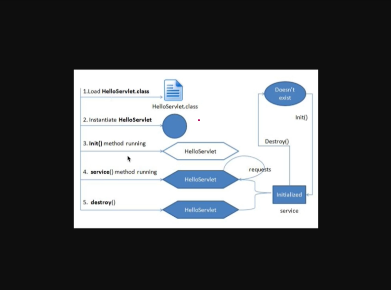

### Lifecycle

1- Container , servlet class dosyalarini bulur.
 sonrasinda loading işlemi yapilir.

2- Servlet classlar'ı
- public olmak zorundadır. 
- public no-arg constructor olmak zorundadır.
- genel olarak servletlerde constructor tanimlamaz.
- constructor yerine init methodu tercih edilir.

3- Servlet initialize
 - initalize mantiği projelerde ihtiyacimiz olacaktır.
 - projeyi ayağa kaldırırken istek karşilandmadan önce yada ilgili servlet çalışmadan önce bir configurasyon
   yapmak isteriz bu mantığa initialize mantiği diyebiliriz.
 - public void init (ServletConfig config) throws ServetException
 - public void init () throws ServetException
 - init metodu lifecycle boyunca bir kez çalışır.

4- Servising 
 - servlet objesi oluştu.
 - servlet initalize oldu.
 - bu noktadan sonra artık istekler karşılanabilir. (handle request)
 - service metodu bu noktada override edilmemelidir.
 - gelen her isteğe karşılık bir thread oluşur.
 - her sevlet için sadece bir tane instance oluşur.
 - her istek bir thread sadece bir obje oluşur.
 -  doGet,doPost, doHead  vs

