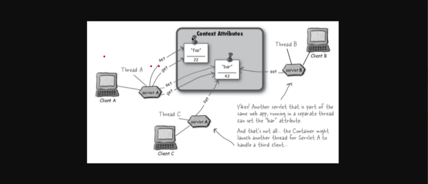

#### Scope Attribute

- Scope lifecycle
    - request --> Yapılan istek boyunca o verlere erişilebilir.
    - session --> Aynı oturumdaki tüm clientler görebilir. farklı tarayıcılarda birbirlerinin attributeleri göremezler.
    - context --> Uygulama ayakta kaldığı sürece tüm clientlar (browser lar) tarafından erişilebilir.
      attribute yukarıda scopelara eklemiş olduğumuz objeler
      bu scopelarda  var olurlar .
- context eklenen attribute ler uygulama ayakta kaldığı sürece tüm servletler tarafından görülebilir.

  Object getAttribute(String var1);

  void setAttribute(String var1, Object var2);

  void removeAttribute(String var1);

 