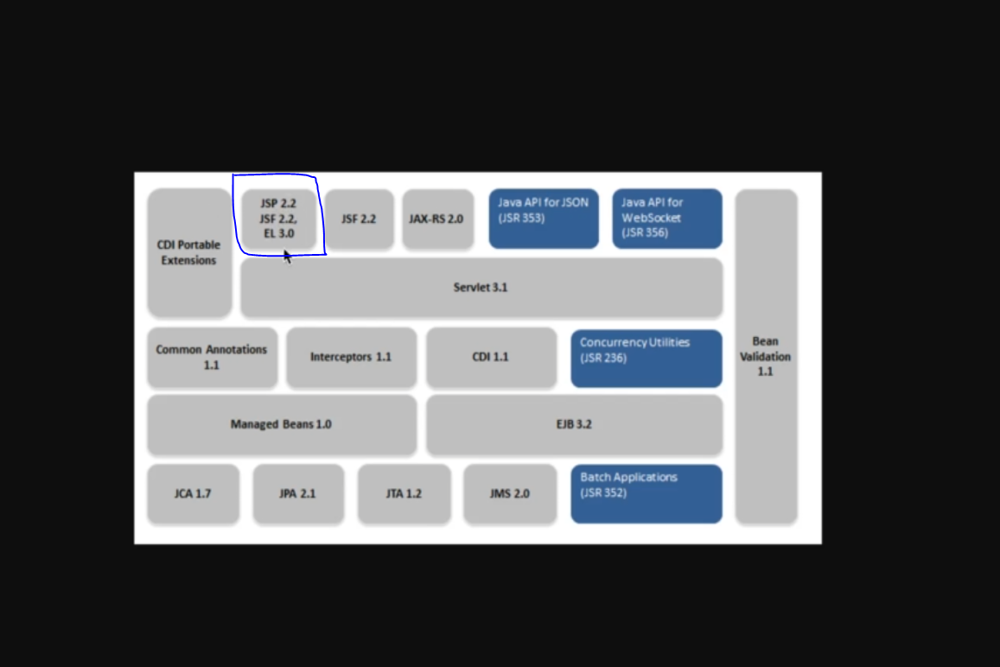
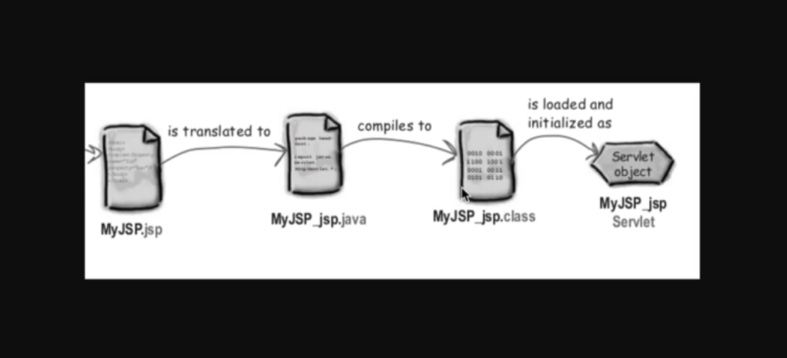

#### JSP (Java Server Pages)


- JavaEE nin bir bölümüdür.
- Dinamik web sayfaları oluşturmak için.
- JSP sayfalarında java kodu yazabiliyoruz.
- servletle ile çalışırken , java kodları arasında basit olarak html kodları yazdik.
- RequestDispatch
- controllerdan istek -> jsp diğer view layer frameworkune dispatch edilir.
- viw layer model
  - son kullanıcıya datayı göster veya son kullanıcıdan datayı al(form).
  - bunun dışındaki işlemler view layerda (jsp) yapılmaz.
  - mvc temel noktalardan bir tanesi :seperation of concern dur.
  - jsp dosyları , Servlet container tarafından sevlet sıniflarina .java dosyalarina translate edilir.
  - sonrasinda compile edilir .class dosyalari oluşur.



#### JSP PAGE
  #### 1. Scriplet 
      <% java code %>  
      jsp scriplet olarak tanımlanır. jsp sayfalarinda java kodu yazabiliriz bunun için scriptlet kullanmamiz gereklidir.
  #### 2. JSP Expression
      tarayıcıya direk yazı yazmak için kullanılır.
     <%=expression%>
    - jsp scriplet ve jsp expression kodları translate işlemi sonrasında aynı method içerisinde yer alacaktır.
      dolayısıyla tanımlanan değişkenler local değişkenlerdir. 
    - expression sonrasinda noktalı virgül koyma
    
  #### 3. JSP Declaration
     <%! %>
    - instance variable yada instance method tanimlanabilir.
```
     <%!
                public int topla(int a, int b) {
                    return a + b;
                }
            %>
```
   #### 4. JSP Action
   <jsp:action_name attribute=""/>

   #### 5. JSP Comment
   <%-- --%> html de görünmez son kullanıcıya gösterilmez.

   #### 6. JSP Directive
   - <%@      %>
   - <%@ page
   - <%@ include
   - <%@ taglib 
   
NOT: Jsp dosyalarını translate edilmiş hali tomcat/work/Catalina/ altında bulunur.
 #### Jsp implicit  
  - JspWriter           <> out
  - HttpServletRequest  <> request
  - HttpServletResponse <> response
  - ServletContext      <> application
  - HttpSession         <> session
  - ServletConfig       <> config
  - Throwable           <> exception
  - PageContext         <> pageContext
  - Object              <> page 
     vs...

 #### JSP Page Lifecycle
  - jspInit()
  - jspService(req,res)
  - jspDestroy()
